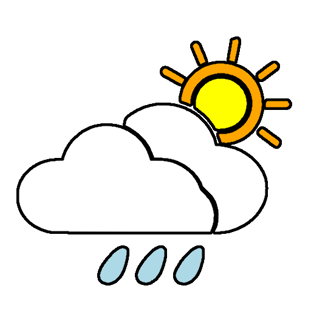

# Weather App for Finland


[](https://flutter.dev/)
[](LICENSE)
[](https://flutter.dev/multi-platform/)
[](https://dart.dev/)
[](https://appwrite.io/)

A comprehensive weather application for Finland, providing accurate forecasts, weather warnings, and radar imagery. Built with Flutter and powered by Open-Meteo API and Finnish Meteorological Institute (FMI) Open Data.

## Features

- **Real-time Weather Forecasts**: Get up-to-date weather information for any location in Finland
- **Location-based Weather**: Automatically fetch weather for your current location
- **Favorite Locations**: Save and manage your favorite locations
- **Weather Warnings**: View official weather warnings and alerts with severity indicators
- **Weather Radar**: Interactive weather radar map
- **Weather Symbols**: Visual guide to understanding weather symbols
- **Multi-language Support**: Available in English and Finnish
- **Dark Mode & AMOLED Theme**: Choose your preferred theme
- **Cloud Synchronization**: Sync your favorite locations across devices using Appwrite
- **Temperature Units**: Switch between Celsius and Fahrenheit
- **Responsive Design**: Works on mobile, tablet, and desktop platforms

## Data Sources

This app uses the following data sources:

- **[Open-Meteo API](https://open-meteo.com/)**: For weather forecast data
- **[Finnish Meteorological Institute (FMI) Open Data](https://en.ilmatieteenlaitos.fi/open-data)**: For weather warnings and radar imagery
- **[Appwrite](https://appwrite.io/)**: For user authentication and data synchronization
- **[OpenStreetMap](https://www.openstreetmap.org/)**: For map data
- **[OpenWeatherMap](https://openweathermap.org/api)**: Reverse geocoding
- **[National Land Survey of Finland](https://www.maanmittauslaitos.fi/en)**: Reverse geocoding

## Project Architecture

The app follows a clean architecture approach with the following structure:

- **lib/**: Main source code directory
  - **data/**: Data models and API clients
  - **l10n/**: Localization files
  - **pages/**: UI screens
  - **widgets/**: Reusable UI components
  - **app_state.dart**: Global state management
  - **appwrite_client.dart**: Appwrite integration
  - **main.dart**: Application entry point
  - **routes.dart**: Navigation routes

The app uses:
- **Provider** for state management
- **Go Router** for navigation
- **Appwrite** for backend services
- **Flutter Map** for map rendering
- **Intl** for localization

## Getting Started

### Prerequisites

- Flutter SDK 3.6.0 or higher
- Dart SDK 3.6.0 or higher
- An Appwrite account (optional, for cloud synchronization)
- Git and Git LFS installed


## Appwrite Configuration

This app uses Appwrite for user authentication and synchronizing favorite locations across devices. To set up your own Appwrite backend:

1. Create a new project in the Appwrite console
2. Set up the following resources:

### Database Setup

1. Create a database with ID `sync`
2. Create a collection with ID `favourites` with the following attributes:
   - `lat` (double): Latitude of the location
   - `lon` (double): Longitude of the location
   - `name` (string): Name of the location
   - `region` (string, optional): Region of the location
   - `countryCode` (string): Country code
   - `country` (string, optional): Country name
   - `index` (integer): Order index for the location

### Authentication Setup

1. Enable Email/Password authentication in the Appwrite console
2. Configure any additional authentication methods as needed

### Update Client Configuration

Update the endpoint and project ID in `lib/appwrite_client.dart`:

```
AppwriteClient._internal() {
  client = Client()
      .setEndpoint("YOUR_APPWRITE_ENDPOINT")
      .setProject("YOUR_PROJECT_ID");
  account = Account(client);
  realtime = Realtime(client);
}
```

## Testing

The app includes unit tests to ensure functionality works as expected. To run tests:

```bash
flutter test
```
